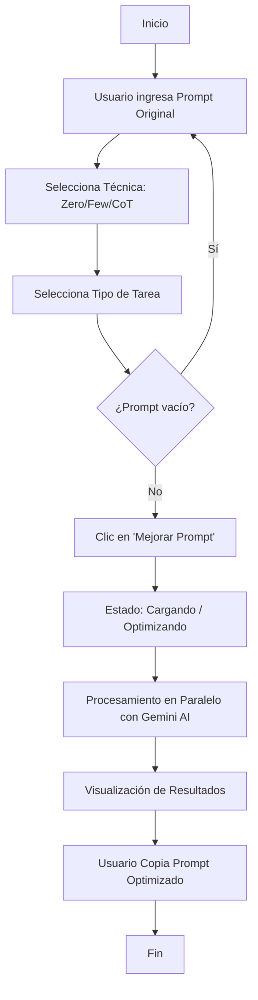
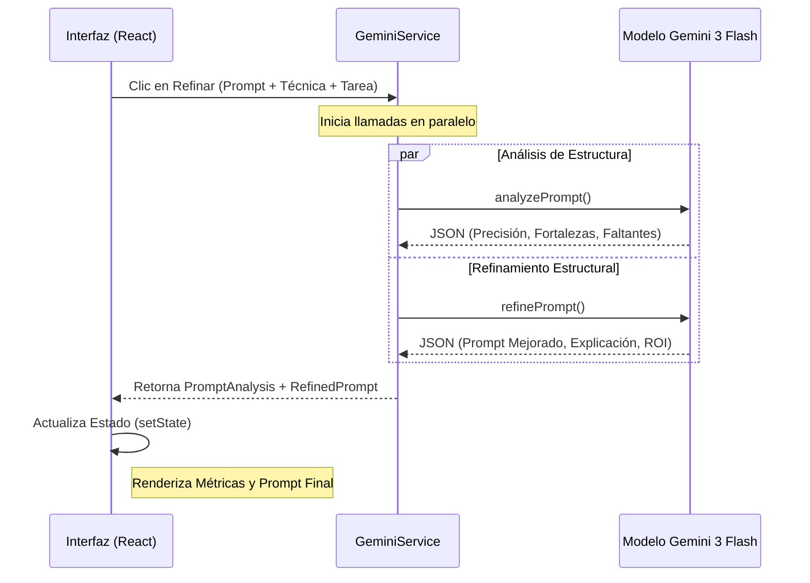
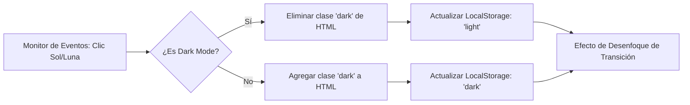

# Flujo de Procesos: Prompt Maestro SENA

Este documento describe la arquitectura lógica y los flujos de interacción de la aplicación utilizando diagramas de procesos.

---

## 1. Flujo General de Usuario
Este diagrama describe el camino que sigue un usuario desde que ingresa un prompt hasta que obtiene el resultado optimizado.

---

## 2. Lógica de Procesamiento AI (Backend-simulado)
La aplicación utiliza el modelo **Gemini 3 Flash** para realizar dos tareas críticas de forma simultánea.

---

## 3. Gestión de Tema (Modo Oscuro)
La aplicación mantiene la preferencia del usuario utilizando persistencia local.

---

## 4. Estructura de Datos (Prompt Refinado)
Cada prompt generado debe cumplir con la arquitectura institucional definida:

| Componente | Descripción |
| :--- | :--- |
| **Rol** | Define la identidad experta que debe asumir la IA. |
| **Tarea** | La instrucción clara y directa de lo que se debe hacer. |
| **Contexto** | Información de fondo, restricciones y detalles específicos. |
| **Formato** | Cómo debe entregarse la información (JSON, Tabla, Lista, etc.). |

---
*Manual técnico de procesos - Prompt Maestro SENA 2026*
